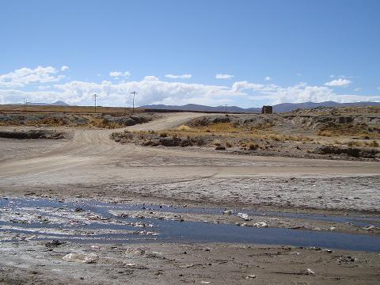

+++
title = "The Altiplano"
date = 2008-06-03
location = "Obrajes"
tags = ["projects", "favorites", "travels", "outside"]

[extra]
thumbnail = "projects/altiplano/the-altiplano-thumbnail.jpg"
+++

I traveled to Obrajes, Bolivia in the summer of 2008 as part of an Engineers Without Borders team.
Patrick and [Steph](http://stephjang.com) went too, woo!)
The communities in the area are seasonally impeded by a river that swells with the rains and mountain runoff --
crops cannot be taken to the nearby city of Oruro and children are sometimes kept from school by the waters.

Our small team took survey data of the river contours,
tested the soil's bearing capacity, and conducted numerous interviews with residents,
all in preparation for a potential bridge construction project to take place in 2009.
The report I created to summarize the MATLAB analysis of the survey data
may be viewed [here](http://www.scribd.com/doc/75417759/Bolivia-Survey-Report).

This work generated a lot of reflection on issues of project sustainability and impact.
Should US citizens be building infrastructure in Bolivia?
I'm not so sure.. But Evo promised a bridge and had not yet delivered.
And the communities made it clear that this was important.
I'm no longer involved with the work since the summer's end,
but many Duke students traveled to the area in 2009 and completed a crossing.

Up-to-date information about the Bolivia team's work can be viewed
on the [team's wiki](https://wiki.duke.edu/display/engineerswithoutborders/bolivia).
And all of my photos from this amazing trip are online [here](http://picasaweb.google.com/mattball43/Bolivia2008).
