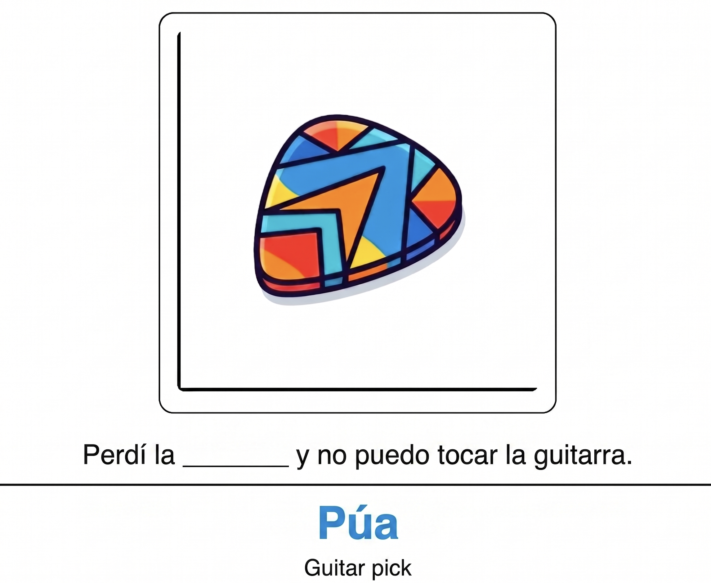
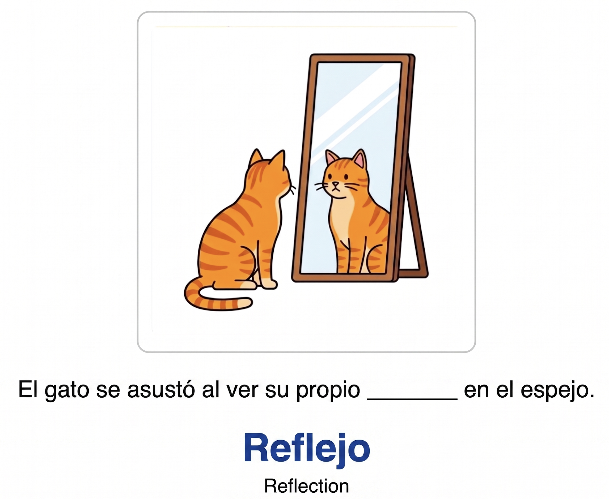
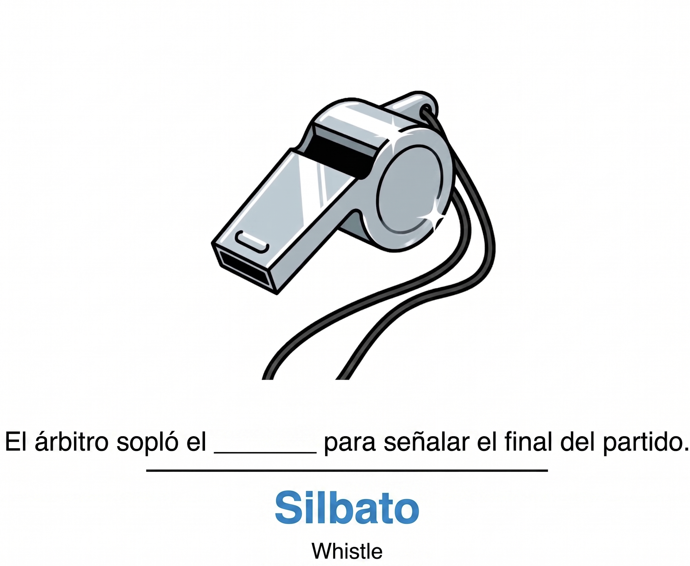

+++
title = "anki-castellano"
date = 2026-04-24
location = "Barcelona"

[extra]
thumbnail = "projects/anki-castellano/anki-castellano-icon.png"

+++

I'm making [Anki](https://apps.ankiweb.net) flashcards to study Castellano.
I've updated the card format over time,
at the moment they are "cloze deletion" -- a Castellano sentence missing a word.
On the back is the missing Castellano word, the English translation of that word, and a corresponding image.
Below are some examples of older cards where the word was on the card "front."

The pipeline to generate an anki deck:

0. An LLM generates a Castellano wordlist based on a topic.
In the prompt I hardcode for intermediate difficulty -- so words more like "cliff" and less like "house."
The LLM is also prompted to create a cloze deletion-style sentence for the word and the translation to English.
I'm using some recent version of gemini flash for this and that's very cheap.
1. I use another LLM call to create corresponding images for each word.
The prompt was another piece generated in the previous text-only call.
This is relatively expensive, single digit cents per image. I use gemini as well.
The images are optional but very fun to include.
2. Another small script creates the Anki deck itself.
For now I'm just making entire new decks when I want to add cards to my study practice.

Some example cards:

---

---

---

I added the decks to ankiweb here: [ankiweb.net/shared/info/1563878917](https://ankiweb.net/shared/info/1563878917)

And the code for all this: [github.com/yosemitebandit/anki-castellano](https://github.com/yosemitebandit/anki-castellano)

Would be cool if..
- support Castellano -> languages other than English
- support Catalan (what's next) -> English
- it was truly Cloze style (one card for multiple fill-in-the-blanks throughout a sentence)
- audio recordings of the sentences and words
