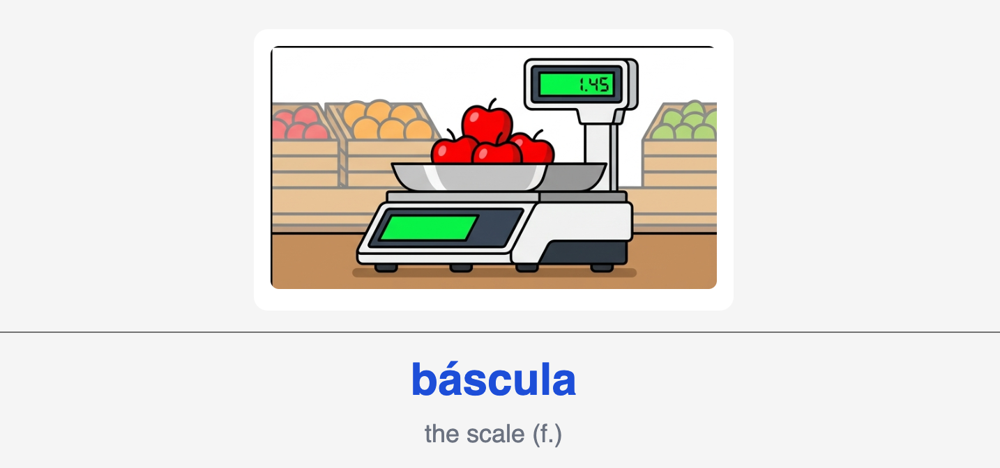
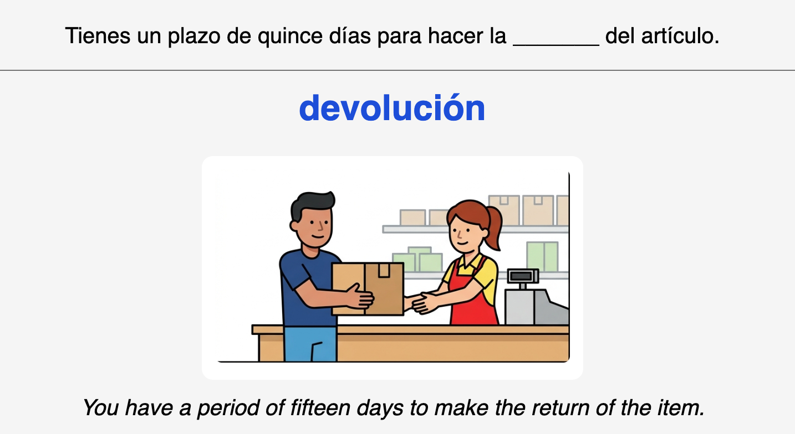

+++
title = "anki-castellano"
date = 2026-04-24
location = "Barcelona"

[extra]
thumbnail = "projects/anki-castellano/anki-castellano-icon.png"

+++

I'm making [Anki](https://apps.ankiweb.net) flashcards to study Castellano.
I've updated the card format over time,
in the latest version each target word that I'm trying to learn gets up to four associated cards:

Type One: translate the English word to Castellano:
> `"the capacity limit" -> "aforo"`

Type Two: identify the Castellano word from an image:

Type Three: fill in a missing word in a Castellano sentence (cloze):

Type Four: translate a full Castellano sentence (with audio):

<audio controls src="franqueo.wav"></audio>

The pipeline to generate the assets and ultimately a full anki deck:

0. An LLM generates a Castellano wordlist based on a topic.

> In the prompt I hardcode for intermediate difficulty -- so words more like "cliff" and less like "house."
> The LLM is also prompted to create sentences for the word and the translation to English using a mix of grammar and verb conjugations.
> I'm using the latest and greatest gemini pro for this, and that's pretty inexpensive.

1. I create corresponding images for each word using another LLM call.

> The prompt for this was another piece generated in the previous text-only call.
> This is relatively expensive, single digit cents per image. I use gemini as well.
> The images are optional but very fun to include.
> To save a little money I batch four prompts into a 2x2 grid and then split the result into four separate images with PIL.

2. I similarly generate audio using gemini TTS which handles the pronunciation very well

3. Another small script creates the Anki deck itself.

> For now I'm just making entire new decks when I want to add cards to my study practice.

More example cards from early deck-building:

---

---

---

I'm adding decks to ankiweb:
- [ankiweb.net/shared/info/1082986108](https://ankiweb.net/shared/info/1082986108)
- [ankiweb.net/shared/info/1563878917](https://ankiweb.net/shared/info/1563878917)

And the code for all this: [github.com/yosemitebandit/anki-castellano](https://github.com/yosemitebandit/anki-castellano)

Would be cool if..
- support multiple input and output languages
- true Cloze style (one card for multiple fill-in-the-blanks throughout a sentence)
