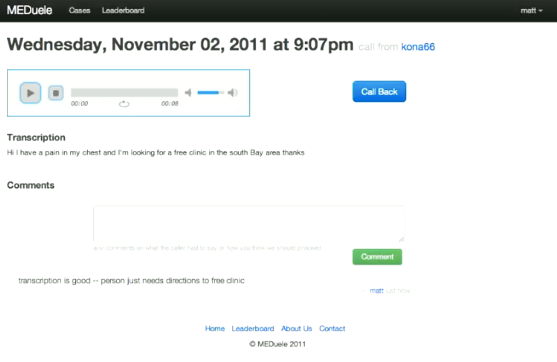
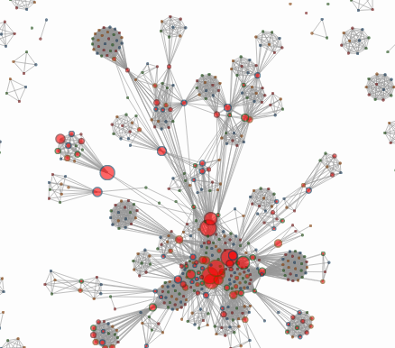

+++
title = "Bay Area Hackathons"
date = 2011-01-01
location = "SF Bay Area"
tags = ["projects", "favorites", "hackathons", "python", "js", "hardware"]

[extra]
thumbnail = "projects/bay-area-hackathons/doubleyou-thumbnail.png"
+++

lots of hackathons around the bay area!

## MEDuele - Berkeley (2011)

Me and my friends [Steph](http://stephjang.com), [Will](http://iamwillpatrick.com) and [Patrick](http://stanford.edu/~ppye)
built a multilingual nursing hotline and website, MEDuele, for the Cal Health Data Hackathon.
We came up with the idea from Patrick's experience volunteering in a free South Bay medical clinic.
Patrick, being the Renaissance man that he is,
worked as a translator for patients speaking Mandarin and Spanish.
He noticed the clinic was always really busy but didn't have enough resources to see that many patients.
We thought of MEDuele as a proof-of-concept triaging system.

Patients could call the MEDuele hotline and essentially "leave a message after the beep" describing their ailments.
To triage these patients, two teams of people would use the MEDuele webapp --
the first would simply translate and transcribe the message when the caller spoke a language other than English.
The second group, one with more medical expertise, would then recommend a course of action.
And the group of translators could then call the patient back with recommendations.

Of course there would be a lot of valid concerns around a patient's private information --
thankfully this was just a hackathon / proof of concept, and we didn't have to delve into that.
But we did get some good feedback from the experts on the judging panel,
they found it interesting and encouraged us to pursue it as a company.

The source for the site is [on github](https://github.com/yosemitebandit/meduele)
and there's a short demo video of the site in action [here on youtube](https://www.youtube.com/watch?v=q_gSaW4sj6I).
(Alas, I recently let go of the callmeduele.org domain.)

## ClusterBus - SF (2012)

During the [ReRoute/SF hackathon](http://hattery.com/reroutesf/),
I helped build a way to examine [bus-bunching](http://en.wikipedia.org/wiki/Bus_bunching)
with Boaz, Wai Yip, Trucy and Kevin.
We were thinking about the really busy bus lines
and how they sometimes get 'clumped' with two buses on the same line only separated by a few seconds.

This happens when one bus gets behind and the second driver adheres to his schedule.
Some transit agencies will tell the second driver to pass or slow down.
But SFMTA operates based on on-time performance,
so the second driver is incentivized to stay on his schedule,
regardless of the first bus's trouble.
Other agencies handle this a little better by optimizing 'headway,' or the spacing between the buses.
Spacing is what riders really care about – on a crowded line, they just want to minimize their wait.
Being precisely on schedule is less important when buses come every five minutes.

So we built a way to look at the headway of historical data on certain lines.
We pre-processed lots of old GPS data to calculate the headway of buses,
and we then generated some metrics based on certain periods of time.
SFMTA operators said they might be interested in using these tools in a live operation
so the dispatchers can better control the spacing of their drivers.

I worked on the frontend, bits of the API and some of the pre-processing.
The main site is in a state of flux.. but the code is [on github](https://github.com/yosemitebandit/clusterbus).

## DoubleYou - Berkeley (2012)

After building [MEDuele](https://github.com/yosemitebandit/meduele) in 2011,
I returned to the [Cal Health Hackathon](http://blogs.ischool.berkeley.edu/hackinghealth/)
to work with [Steph](http://stephjang.com/), [Patrick](http://stanford.edu/~ppye/),
[Cyrus](http://www.cyrusstoller.com/), [Jas](http://www.iamjasdeep.com/) and Kristen on another idea.

One of the hackathon's challenges was to build something
that encourages the use of a bodymedia fitness tracker armband.
These are wearable sensors that log heartrate and accelerometer readouts (footsteps) throughout a normal day.
We also had a sample dataset from the armband
but we wanted to do more than just create a typical dashboard of charts.

So we began thinking about how this might be presented to a child.
We came up with a [Tamagotchi-like](http://en.wikipedia.org/wiki/Tamagotchi) system --
an online avatar would represent the data coming from the armband and other sources.
This 'DoubleYou' would be an easy way for a child to understand
his or her progress towards fitness and dietary goals.

The site we demoed was at mydoubleyou.org but we no longer maintain that domain.
Steph built some great avatars that react to parameters like fitness and mood.
I helped build the backend, crunch the sample data and setup an API for the avatars to consume.
The code is [on github](https://github.com/yosemitebandit/doubleyou).
And we ended up taking second place, woo!

## Target Accrual - Palo Alto (2013)

Some friends and I built targetaccrual.com for the StartX-Med hackathon at Stanford.

It's two frankly separate ideas..
We wanted to build a network graph of researchers for the Rare Cancer Research Foundation
(led by friends that work on the [Chordoma Foundation](http://chordoma.org)).
PubMed was scraped to establish co-authorship networks for various diseases.
See [github](https://github.com/yosemitebandit/crabnet) and the demo for more.

To present a business angle, we got into headhunting for clinical trials.
Many trials fail due to a lack of enrollment and these failures are expensive.
We planned to use scraping systems to inform a custom ad network.
Ads would be targeted to connect doctors, candidates and trials.

## Redream - SF (2013)

I helped build a dream restoration machine during a hackathon hosted by GAFFTA and the Tribeca Institute.
Our site took written memories of dreams and pieced together video montages that evoke the nocturnal experience.

We used to tweet out all the dreams on [`@redream_us`](https://twitter.com/redream_us),
but we no longer have the redream.us domain, and the compilations were rendered client side,
so the montages are lost to time :(

We applied some really simple natural language processing techniques to find keywords in the dreams people described,
and we pulled clips based on those keywords from Vimeo and the Prelinger Archive.
The videos were spliced together on the site and kind of time-shifted,
so the dream would seem to loop, but they'd be subtly different each time.
And we let the audio of all clips play simultaneously --
this was my favorite change that made the montages really flow.

Some of the filmmakers on the team put together [this great compilation by hand](https://vimeo.com/62589601) --
it gives some feel for what the reconstructed dreams are like.

This team was really, really great -- everyone's listed [here](https://github.com/yosemitebandit/redream/blob/master/serve/templates/about.html).
We put our code [on github](https://github.com/yosemitebandit/redream),
and the readme goes through more of the technical specifics if you're curious!