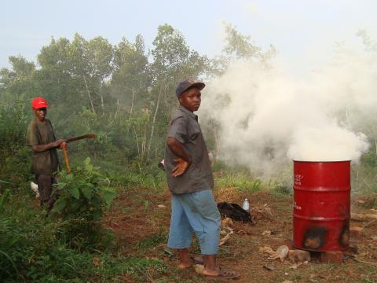

+++
title = "Biomass Charcoal"
date = 2007-11-15
location = "Durham"
tags = ["projects", "favorites", "outside"]

[extra]
thumbnail = "projects/biomass-charcoal/bmc-thumbnail.jpg"
+++

My friends and I closely followed [Amy Smith](http://d-lab.mit.edu/people/amy_smith)
and the [D-Lab's](http://d-lab.mit.edu/) research
on biomass charcoal production.
She was operating in Haiti, pyrolizing corn cobs to create a safe cooking fuel.
Smoke-inhalation from indoor cooking fires is
the number one killer of children in the developing world
and smokeless charcoal is an ideal alternative to burning sticks or other matter.
Producing traditional wood-based charcoal is becoming more difficult
in Haiti, Uganda, and elsewhere due to rampant deforestation.

The D-Lab developed a small-scale pyrolysis process
which we expounded upon in experiments in the States as well as in Uganda (see the photo below).
Some notes on our work, collected by Dan Moss,
are on the [Duke Wiki](https://wiki.duke.edu/display/engineerswithoutborders/Biomass+Charcoal).

