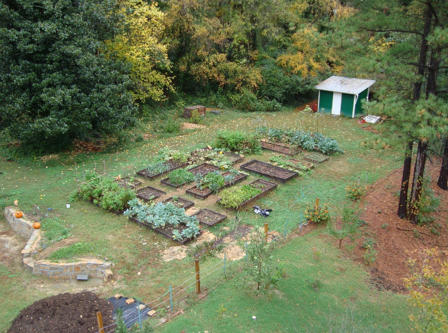

+++
title = "Duke Community Garden"
date = 2008-10-24
location = "Durham"
tags = ["projects", "favorites", "woodworking"]

[extra]
thumbnail = "projects/duke-community-garden/dcg-moving-beds-thumbnail.png"
+++

I loved working at the garden --
I got to design and build raised beds, a hoop house, a shed, a bat box,
bluebird houses, compost bins and an experimental rainwater harvesting system.
I surveyed the site and helped work with volunteers at other area gardens too
(like the excellent Durham group [SEEDS](http://www.seedsnc.org/)).

Here's the garden's north half:

Made so many friends here -- Emily, Margareta, Daniel, Kellyn, Joe..
More photos are on [our old flickr page here](https://www.flickr.com/photos/35445571@N03/).
Hope to be part of another garden someday!