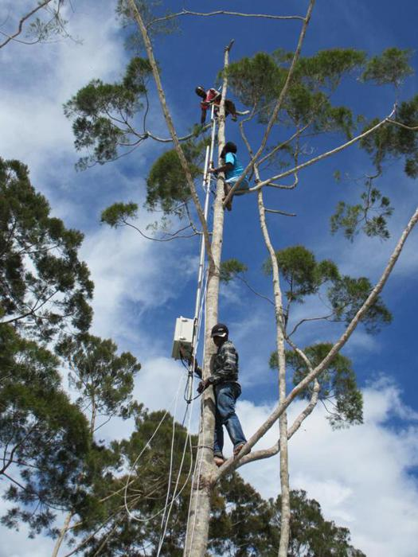
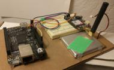

+++
title = "Endaga"
date = 2015-08-04
location = "Oakland"
tags = ["werk", "python", "projects", "hardware", "favorites"]

[extra]
thumbnail = "projects/endaga/endaga-box-thumbnail.jpg"
+++

I worked for about six months at [Endaga](https://www.endaga.com), building low cost cellular infrastructure.
Endaga built cell phone tower hardware -- entrepreneurs could buy our equipment
and use our cloud services to become the "Verizon" of their area.
They could buy SIM cards and sell service to people in their community.
Our system allowed operators to set their own prices for calls and SMS and,
(eventually) data -- we provided something 2.5G-ish, with really slow GPRS-based data.
[This paper from Endaga's founders (pdf)](small-scale-cell-networks.pdf)
provides a lot of detail about the network and its operation.

I loved working on this project and with the team --
Shaddi, Kurtis, Lance, Kashif and Omar.
I helped maintain the backend code running on our servers
and I worked on the code that ran on the towers themselves.
We maintained billing and usage data, hand-built some of the early boxes,
worked on interesting networking challenges, built cool react-based frontends,
and connected lots of folks to the wider world.

I also built [`eno`](https://github.com/endaga/eno-python),
a "programmable cell phone" testing system.

We wanted to be able to test our boxes with real phones creating real traffic.
Eno used a Beaglebone Black and an [Adafruit Fona](https://www.adafruit.com/product/1946)
(with an attached Endaga SIM card) to send messages and place calls.

The Beaglebone nodes ran a small command and control server,
while the testing machine used a simple API to pass messages to the test nodes.

It was very rewarding and fun work.
The founding team was acquired by Facebook in 2015, but we all parted on good terms.
The Endaga work became part of [Facebook TIP](http://telecominfraproject.com)
and the software should be open sourced before too long!

See more [on github](https://github.com/endaga/eno-python)!
