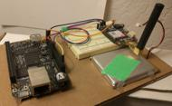

+++
title = "eno"
date = 2015-08-04
location = "Oakland"
tags = ["werk", "python", "projects", "hardware"]
+++

At Endaga I worked on [`eno`](https://github.com/endaga/eno-python),
a "programmable cell phone" testing system.

Endaga built really affordable cell phone towers
and we wanted to be able to test our boxes with real phones creating real traffic.
Eno used a Beaglebone Black and an [Adafruit Fona](https://www.adafruit.com/product/1946)
(with an attached Endaga SIM card) to send messages and place calls.

The Beaglebone nodes ran a small command and control server,
while the testing machine used a simple API to pass messages to the test nodes.

See more [on github](https://github.com/endaga/eno-python)!
