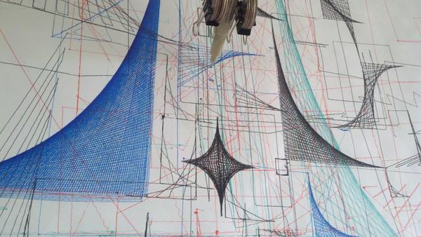

+++
title = "Erik the Wall Plotter"
date = 2011-12-16
location = "SF"
tags = ["projects", "python", "hardware", "favorites"]

[extra]
thumbnail = "projects/erik-wall-plotter/erik-thumbnail.jpg"
+++

Inspired by several other vertical wall-plotters we saw online,
my buddy [Will](http://iamwillpatrick.com/) and I built Erik, a drawing robot.

It uses two stepper motors to pull a pen around a canvas.
But the pen cannot be lifted!
So there are some interesting path-generation challenges.
The software that interfaces with the controller board was written by us and it's available
[on github](https://github.com/yosemitebandit/erik).

{{ youtube(id="xD0XaaPgq-8") }}