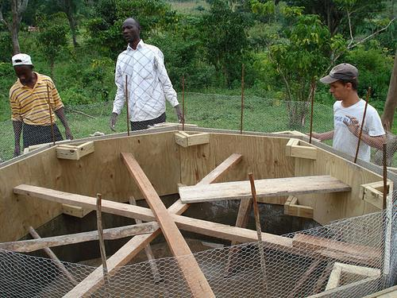
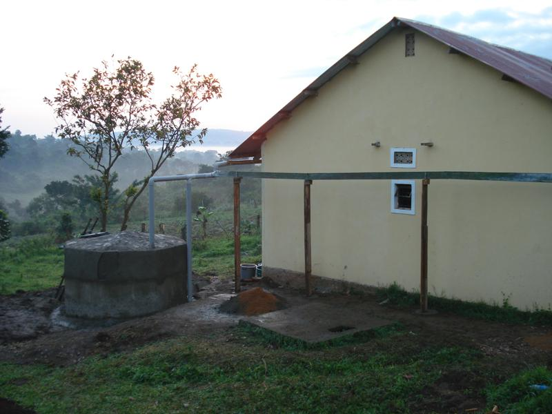
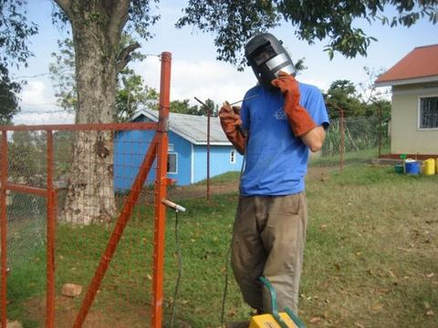
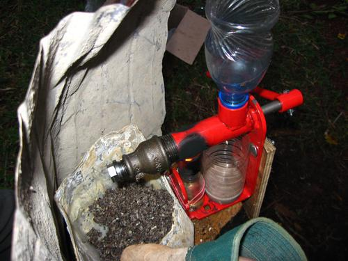
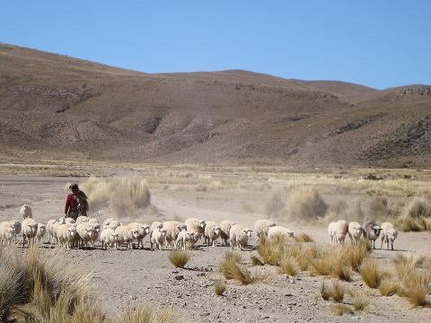

+++
title = "Engineers Without Borders"
date = 2007-08-09
location = "Uganda, Bolivia, North Carolina"
tags = ["projects", "favorites", "travels", "outside", "woodworking"]

[extra]
thumbnail = "projects/ewb/rwh-thumbnail.jpg"
+++

I really enjoyed working with EWB throughout my time in college,
and I learned a lot from the local partners too.

## Rainwater Harvesting - Uganda (2007)

I lived and worked for three weeks in rural Uganda with friends from the States
(including [Patrick](http://stanford.edu/~ppye/), woo!)
and with our hosts from the Central Buganda University.
An assessment team had visited the community in 2006 and, working with CBU,
determined that clean water access was an area where we could lend a hand.
That group decided rainwater harvesting and a small hand washing campaign was the way to go.

Back stateside, I started conducting some rainwater harvesting simulations in MATLAB
based on the size of the communities, some info on the catchment buildings and weather data from the area.
This gave us estimates of supply and demand which we used to size several rainwater harvesting tanks
(Uganda has one and sometimes two rainy seasons.
Our goal was to store enough water to get people through the dry spells).

I designed some formwork for building a 2900 gallon octagonal tank with 4" concrete walls.
We built the formwork in the US and flew it to Uganda (!)
We used the forms to pour three sections of two foot high walls on top of one another, after setting the foundation.
Rebar and a wire mesh made up the roof.

Here we are, just prior to pouring the second "lift."

So we ended up with one finished tank that continues to function to the present day (woo!).
And my friend Patrick and I became pretty good friends with Kenneth,
a really nice guy that has gone on to do interesting things all over Uganda.

There were some challenges that I should probably note:
The tiny community of Kasaka already had a handful of rainwater harvesting tanks in various states of disrepair,
which made me wonder why our team was building another one.
It was clear the Ugandans we worked with knew how to build these things and our formwork method was atypical.
The biggest lesson: talk to the local group as often as possible, there really can't be enough need-finding.

## Biomass Charcoal - Uganda (2007)

My friends and I closely followed [Amy Smith](http://d-lab.mit.edu/people/amy_smith)
and the [D-Lab's](http://d-lab.mit.edu/) research
on biomass charcoal production.
She was operating in Haiti, pyrolizing corn cobs to create a safe cooking fuel.
Smoke-inhalation from indoor cooking fires is
the number one killer of children in the developing world
and smokeless charcoal is an ideal alternative to burning sticks or other matter.
Producing traditional wood-based charcoal is becoming more difficult
in Haiti, Uganda, and elsewhere due to rampant deforestation.

The D-Lab developed a small-scale pyrolysis process
which we expounded upon in experiments in the States as well as in Uganda.
Some notes on our work, collected by Dan Moss,
are on the [Duke Wiki](https://wiki.duke.edu/display/engineerswithoutborders/Biomass+Charcoal).

## RASD Partnership - Uganda (2008)

I spent the better part of the summer in Nkokonjeru working with friends
and the awesome people at the Rural Agency for Sustainable Development.
Led by Ignitius Bwoogi, RASD provides agricultural assistance,
leads local health programs, and offers technical training to the community.
RASD and Ignitius are very well-respected within the community
and this was our group's third year of working with him.

My buddy [Will](http://iamwillpatrick.com) worked for many months
to plan out some of the infrastructure projects
that RASD believed would help the organization make money and better serve the community.
We worked with them during the summer to create a welding and carpentry workshop, classrooms, and a fence.

Ignitius's largest goal was to set up an internet cafe at RASD --
it would be the first in the community
and could provide a steady stream of income to finance RASD's other programs.
I played a small part in helping Will set this up
with solar-powered Inveneo computers and Meraki routers.

## Jatropha Bio-fuel - Uganda (2008)

Kerosene for lamps and generators is incredibly expensive in Uganda,
with some households spending 30% of their income on the fuel.
We wanted to work with RASD and explore the possibilities of small-scale bio-oil production
using [Piteba presses](https://www.piteba.com/index.html).
The presses used a candle to heat a hand-cranked screw press.
We made quite a bit of peanut butter during testing in the States
and the presses proved to work decently well with jatropha seeds.

The seeds are poisonous if ingested so some safety precautions had to be observed.
We worked with RASD to find a small quantity of ripe seeds but,
after producing a small amount of oil, we were unable to ignite it in any sort of lamp apparatus.
Further research was needed on precisely when to pick the jatropha seeds
and how long to store them prior to expelling.
Dan Moss completed a great write-up of the work
[here](https://wiki.duke.edu/display/engineerswithoutborders/Jatropha+Processing).

The backstory for this project is pretty interesting:
Uganda once had a booming vanilla industry and,
vanilla being a vine, the many plants required a support structure.
The jatropha plant was a popular choice for many Ugandan farmers as it grew very rapidly
and was native to the area.
While in Uganda in 2007, my friend Lee Pearson organized a trip
to Royal Van Zanten's enormous flower-growing operation, just a short distance from the capital.
RVZ was just in the midst of a large-scale jatropha operation
intending to power their generators with jatropha-based biodiesel.
We were given a tour of their industrial expelling and filtration process.

## The Altiplano - Bolivia (2008)

I traveled to Obrajes, Bolivia in the summer of 2008 as part of another Engineers Without Borders team.
Patrick and [Steph](http://stephjang.com) went too, woo!)
The communities in the area are seasonally impeded by a river that swells with the rains and mountain runoff --
crops cannot be taken to the nearby city of Oruro and children are sometimes kept from school by the waters.

Our small team took survey data of the river contours,
tested the soil's bearing capacity, and conducted numerous interviews with residents,
all in preparation for a potential bridge construction project to take place in 2009.
The report I created to summarize the MATLAB analysis of the survey data
may be viewed [here](http://www.scribd.com/doc/75417759/Bolivia-Survey-Report).

This work generated a lot of reflection on issues of project sustainability and impact.
Should US citizens be building infrastructure in Bolivia?
I'm not so sure.. But Evo promised a bridge and had not yet delivered.
And the communities made it clear that this was important.
Many Duke students traveled to the area in 2009 and completed a crossing.
