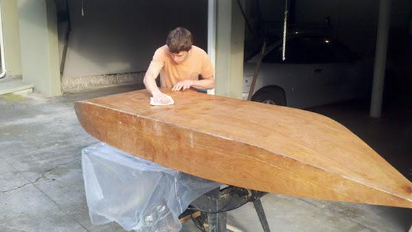

+++
title = "The Prism (Ultimater Version)"
date = 2013-02-09
location = "Menlo Park"
tags = ["outside", "projects", "favorites", "woodworking"]

[extra]
thumbnail = "projects/prism/widowmaker-thumbnail.jpg"
+++

My friend [Trevor](http://trevorshp.com) and I
built a one-sheet boat using plans from the famous [Hannu](http://koti.kapsi.fi/hvartial/oss2/oss2.htm).
All you need is a lone sheet of birch plywood (3/8" I think..),
some 1x2 runners for support and fiberglass for the outer seams where the flat bottom meets the sides.
The inner seams were covered with a thickened resin. The outside has a few coats of Tung oil.

Hannu's 'ultimater' version of the Prism has some stability enhancements and can theoretically displace 800 lbs.
But we got a little nervous with three people inside --
the freeboard gets to be quite low and if you're not all carefully balanced, the bow or stern can swamp.

The boat seems to handle South Bay waters just fine, and we're tentatively discussing a journey to the East Bay,
probably following the narrowing along the Dumbarton Bridge..
